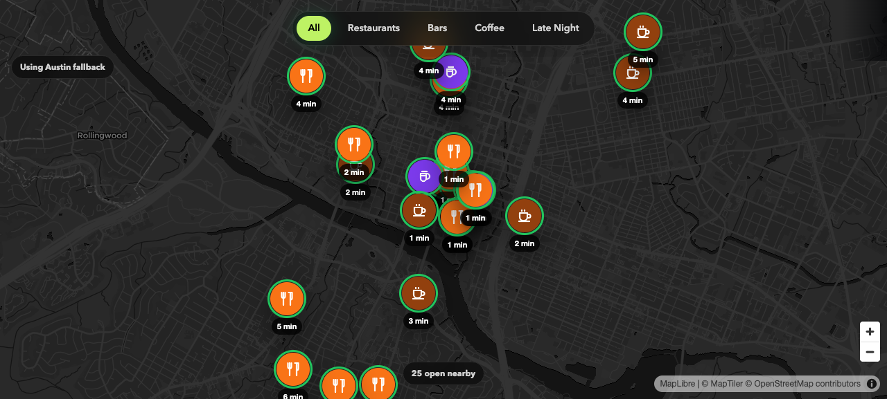

# FoodFinder

FoodFinder is a mobile-first map app for finding restaurants, bars, and coffee shops that are open right now. The map viewport drives the search: pan or zoom and the app refreshes the visible area with only confirmed-open places.



## Links

- GitHub: https://github.com/arnavgokhale12/foodfinder
- Frontend: coming soon
- API: coming soon

## Features

- Shows only currently open restaurants, bars, and cafes
- Filters for all places, restaurants, bars, coffee, and late night
- Viewport-driven results with a zoom gate to protect the Overpass API
- Open/closing-soon visual states with green/yellow pin rings
- OSRM drive-time estimates on pins and detail sheets
- Opening-hours parsing from OpenStreetMap `opening_hours` tags
- Installable PWA with manifest, icons, and service worker
- Mobile safe-area handling for notch and home-bar layouts

## Tech Stack

- Frontend: Vite, React, TypeScript, Tailwind CSS
- Map: MapLibre GL JS loaded from CDN
- Map tiles: MapTiler
- Backend: Express, TypeScript
- Places data: OpenStreetMap via Overpass API
- Hours parsing: `opening_hours`
- Drive time: OSRM public routing table API

## Architecture

```text
client/ React PWA
  -> /api/places
server/ Express proxy
  -> Overpass API for OSM places with opening_hours
  -> OSRM table API for batch drive times
```

The backend exists to keep the frontend simple and centralize third-party API behavior. Overpass requires no key, OSRM requires no key, and MapTiler is the only client-side environment variable.

## Local Setup

```bash
npm install
cp .env.example .env
npm run dev
```

Open:

```text
http://localhost:5173
```

## Environment Variables

```bash
VITE_MAPTILER_KEY=your_maptiler_key
VITE_API_BASE_URL=
PORT=3001
```

## API

```text
GET /api/places?north=&south=&east=&west=&type=&userLat=&userLng=
```

Supported `type` values:

- `all`
- `restaurant`
- `bar`
- `cafe`
- `late-night`

Response shape:

```ts
{
  places: Array<{
    id: string;
    name: string;
    lat: number;
    lng: number;
    photo: null;
    rating: null;
    closingMinutes: number;
    driveMinutes: number | null;
    distanceKm: number;
    address: string | null;
    phone: string | null;
    type: "restaurant" | "bar" | "cafe";
  }>;
}
```

## Deployment

Recommended:

- Frontend: Vercel
- Backend: Railway or Render
- Domain: Vercel subdomain or a custom domain

Included deploy config:

- `client/vercel.json` for Vercel when the project root is set to `client`
- `render.yaml` for a Render web service running the Express API from `server`

The frontend currently proxies `/api` to the local server during development. For production, either:

- deploy the Express server separately and set `VITE_API_BASE_URL` to that deployed backend URL, or
- add a Vercel rewrite to proxy `/api` to that backend.

## Known Limitations

- Overpass is a shared public API and can occasionally rate-limit or time out.
- OSM place coverage depends on whether contributors added `opening_hours`.
- Public OSRM is best-effort and should be replaced with a hosted routing service if traffic grows.
- OSM does not provide photos or ratings, so the UI uses designed category pins instead.

## Scripts

```bash
npm run dev
npm run build
npm run typecheck
```
